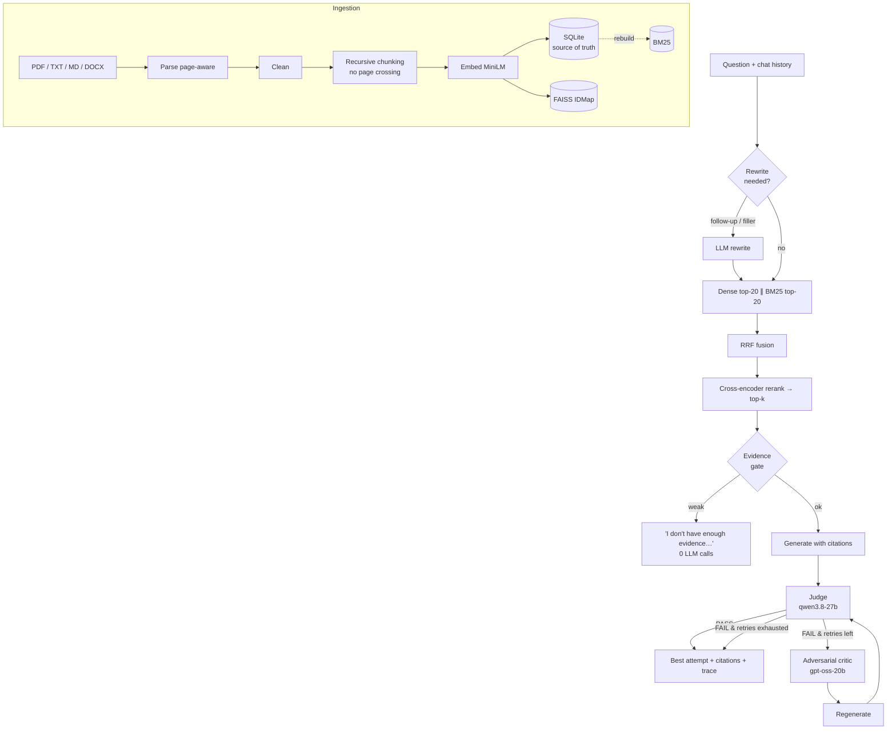

# RAG Reliability Lab

**Hybrid-retrieval RAG with a conditional adversarial reliability loop.** Answers are grounded in your documents with page-level citations, checked by an independent judge model, and only when the judge finds a problem are they critiqued and regenerated. Users get a clean chat with inline, hoverable citations; the evidence scores, judge verdicts, critiques and per-stage timings go to structured backend logs (and the API response) for debugging and evaluation.

`FastAPI` · `LangGraph` · `FAISS` · `BM25` · `SentenceTransformers` (bi-encoder + cross-encoder) · `Groq` (gpt-oss-120b, qwen3.8-27b, gpt-oss-20b) · `Streamlit` · `Docker`

---

## 1. Problem

Retrieval-augmented generation is supposed to stop LLMs from making things up by giving them the source text. In practice RAG systems still:

- **retrieve the wrong passages**, especially for exact identifiers and numbers that embeddings blur;
- **answer anyway** when nothing relevant was retrieved;
- **mix in outside knowledge** that sounds right but is not in the documents;
- give the user **no way to tell** which answers to trust.

## 2. Why normal RAG fails

A standard pipeline is `embed → top-k → prompt → answer`. Each step fails silently. Dense-only retrieval misses lexical matches. The LLM is never asked whether the evidence was sufficient. Nothing checks the answer against the sources after generation. And "fixing" this by always adding a critique-and-rewrite pass can make things *worse*: the first version of this project did exactly that, and its own evaluation showed faithfulness dropping from 4.63 to 3.95 (1–5 scale) at 5.1× the latency, because rewriting correct answers only adds drift. See [`eval/legacy/`](eval/legacy/).

## 3. What adversarial RAG adds here

| Stage | What it does | Why |
|---|---|---|
| Hybrid retrieval | dense (FAISS) ∥ BM25 → Reciprocal Rank Fusion | lexical + semantic recall, scale-free fusion |
| Cross-encoder rerank | rescore top-20 (query, chunk) pairs jointly | precise ordering + a calibrated evidence signal |
| **Evidence gate** | abstain *before* calling the LLM if the best evidence is weak | cheapest, safest answer to an unanswerable question |
| Grounded generation | numbered sources, every claim cited, fixed abstention sentence | traceable answers |
| **Reliability judge** | separate model scores faithfulness / relevance / completeness and lists unsupported claims; **PASS/FAIL decided in code** | measurable trust per answer |
| **Conditional critic → regenerate** | only on FAIL; ≤ `MAX_RETRIES` (default 2) | pay for verification only when it finds something |
| **Best-attempt selection** | return the best-scoring grounded attempt, never a worse retry | the loop cannot degrade an answer |

## 4. Architecture



Code layout:

```
app/
  api/            FastAPI app factory, routes (thin), dependencies
  core/           config (env), domain errors, LLM client protocol + Groq impl
  ingestion/      parsers, cleaning, chunking
  retrieval/      embeddings, FAISS dense index, BM25, RRF, reranker, hybrid + evidence gate
  generation/     prompts, query rewrite, generator/citations, judge, critic
  pipeline/       LangGraph state machine + pure routing functions
  services/       document + query services, composition root (container)
  storage/        SQLite document store
  observability/  tracing (OTel-shaped spans), JSON logging, metrics
  evaluation/     golden dataset, metrics, harness, judge calibration, report
ui/               Streamlit chat UI: answers with inline hover citations (HTTP client of the API)
eval/             golden.jsonl, corpus, run_eval.py, results/, legacy v1
tests/            111 pytest tests (no network, scripted LLM)
docs/             ARCHITECTURE.md, INTERVIEW_GUIDE.md, DEPLOYMENT.md
```

## 5. Retrieval architecture

- **Chunking:** recursive on paragraph → line → sentence → word, ~800 characters with a 120-character word-aligned overlap. Chunks never cross PDF pages, so citations are exact (`paper.pdf — page 4`).
- **Dense:** `all-MiniLM-L6-v2` embeddings (normalized, so inner product = cosine) in `faiss.IndexIDMap2(IndexFlatIP)`, keyed by SQLite chunk id so documents can be deleted.
- **Sparse:** BM25 with Lucene's non-negative IDF (the common Okapi IDF returns zero scores on small corpora; there's a test for that), with a tokenizer that keeps `0.959` and `roc-auc` intact.
- **Fusion:** Reciprocal Rank Fusion, `Σ 1/(60 + rank)`. It uses ranks, not incomparable raw scores.
- **Rerank:** `cross-encoder/ms-marco-MiniLM-L-6-v2` on the top 20 fused candidates. It sits behind a `Reranker` protocol (swap in Cohere/Voyage with one class), and failures fall back to fusion order.
- **Evidence gate:** abstain if the best rerank logit is below −5.0. This was calibrated on real queries: on-topic ≥ −3.2, off-topic ≈ −11.
- Every chunk in the response carries `dense_score/rank`, `bm25_score/rank`, `rrf_score`, `fusion_rank`, `rerank_score`, `final_rank`.

## 6. Reliability loop

- The **judge** returns `{faithfulness, relevance, completeness, unsupported_claims, reason}` (Pydantic-validated JSON). `apply_thresholds()` computes the verdict: FAIL if any score is below its threshold (defaults 0.80 / 0.70 / 0.60), or if any unsupported claim is listed. The second rule exists because the judge was observed listing hallucinations while still scoring faithfulness 0.95.
- The **critic** runs only after FAIL and returns structured `unsupported_claims / contradictions / missing_evidence / weak_reasoning / irrelevant_content / instructions`. If it fails, a critique is derived from the judge output instead.
- **Regenerate** gets the previous answer plus the critique, and must fix every point using only the sources.
- **Termination:** retry counter, `max_retries` (≤ 5, default 2), and LangGraph `recursion_limit`.
- **Selection:** `max(PASS, grounded, aggregate score, earliest)`.
- **Separation of models:** generator `gpt-oss-120b`, judge `qwen3.8-27b`, critic `gpt-oss-20b` (no model grades its own output), all configurable.
- **Exposed:** retries, initial and final judge result, `improved`, and every attempt with its judge result and critique.

## 7. Example

```bash
curl -s localhost:8000/query -H 'content-type: application/json' -d '{
  "query": "Explain in depth how self-attention lets the model detect cheating, and list every limitation of the study."
}'
```

What happened on the included paper during testing (real run, abbreviated). The paper describes the Transformer's configuration but never explains *how* attention detects cheating.

| Attempt | Judge | Failed checks | Unsupported claims |
|---|---|---|---|
| 0 (initial) | FAIL, faithfulness 0.95 | `unsupported_claims` | 3 (invented explanation of self-attention) |
| 1 (after critique) | FAIL, faithfulness 0.95 | `unsupported_claims` | 1 |
| 2 (after critique) | **PASS**, 1.0 / 1.0 / 1.0 | none | 0 |

Final answer: *"The sources do not provide a detailed explanation of how the self-attention mechanism … processes action-level sequences to detect cheating patterns. **Limitations of the study:** All detection results are based on synthetic anomalies … [1][2] …"*. Baseline RAG on the same question returned the invented explanation, with a citation attached.

The response JSON contains `answer`, `status`, `citations[]` (label + chunk text), `retrieved_chunks[]` (all scores), `reliability` (initial/final/attempts/critiques) and `trace` (spans, LLM calls, tokens, throttle time).

## 8. Evaluation methodology

`python -m eval.run_eval --publish` (details in [`app/evaluation/harness.py`](app/evaluation/harness.py)):

- **Golden set** [`eval/golden.jsonl`](eval/golden.jsonl): 22 hand-written questions over the included paper, in four categories: *lookup* (9), *synthesis* (7), *bait* (3: invite outside knowledge), *unanswerable* (3). Each question has expected facts (with accepted aliases) and verbatim evidence snippets. Labels are validated against the corpus before every run.
- **Retrieval ablation (deterministic):** dense-only vs BM25-only vs hybrid RRF vs hybrid + rerank, measuring hit@k, evidence recall@k and MRR.
- **Baseline vs adversarial:** identical retrieval; baseline = single generation; adversarial = the full loop.
- **Deterministic answer metrics:** fact recall, false-abstention rate (answerable), correct-abstention rate (unanswerable).
- **LLM-judged metrics** by an **independent evaluator** (`gpt-oss-120b`, which must differ from the pipeline judge) so the loop is not graded by the judge it optimizes against: faithfulness, relevance, completeness, and the share of answers with any unsupported claim.
- **Cost:** latency (total, and net of provider rate-limit waits), LLM calls, tokens, retry rate.
- **Judge calibration:** 10 hand-made answers (6 with seeded faults, 4 correct) → detection and false-alarm rates.
- Isolated index per run (never touches your data); resumable; raw per-question results in `eval/results/results.jsonl`.

## 9. Results

All numbers come from real runs on 2026-09-24 and are reproducible with the commands above. Full reports: [`eval/results/report.md`](eval/results/report.md) (golden set), [`report_stress.md`](eval/results/report_stress.md) (compound questions), [`report_retrieval_k3.md`](eval/results/report_retrieval_k3.md). Raw per-question outputs are in the matching `results*.jsonl`. **n is small (22 + 6 questions, one document), so treat differences of one question (4–17 points) as noise.**

**Retrieval ablation** (deterministic, 19 labelled questions):

| System | hit@5 | recall@5 | MRR@5 | hit@3 | MRR@3 | p50 latency |
|---|---|---|---|---|---|---|
| Dense only (MiniLM + FAISS) | 0.842 | 0.816 | 0.653 | 0.789 | 0.640 | 14 ms |
| BM25 only | **0.947** | **0.947** | **0.860** | **0.947** | **0.860** | <1 ms |
| Hybrid (RRF) | 0.895 | 0.895 | 0.772 | 0.895 | 0.772 | 14 ms |
| Hybrid + cross-encoder rerank | 0.895 | 0.895 | 0.774 | 0.842 | 0.763 | ~1 s |

**Baseline vs adversarial** (22-question golden set):

| Metric | Baseline | Adversarial |
|---|---|---|
| Fact recall, answerable (deterministic) | 0.898 | 0.898 |
| Correct abstention, unanswerable | 3/3 | 3/3 |
| False abstention, answerable | 11% (2/19) | 11% (2/19) |
| Evaluator faithfulness | 1.000 | 0.994 |
| Answers with ≥ 1 unsupported claim (evaluator) | 0/17 | 1/17 |
| Loop fired (retry rate) | — | **0%** |

**Stress set** (6 compound questions, each an answerable part plus outside-knowledge bait): the loop fired on **1/6** (FAIL → PASS by the pipeline judge). The independent evaluator still found one unsupported claim in that final answer, and rated baseline and adversarial otherwise alike. A +0.17 fact-recall difference came from one question where the *baseline's* generation happened to abstain (no retries were involved), so it is sampling noise, not the loop.

**Judge calibration:** the pipeline judge failed **6/6** seeded faulty answers (wrong number, outside knowledge, contradiction, over-claim, incomplete, off-topic) and passed **4/4** correct controls.

**What this means.**

1. With a strong generator (gpt-oss-120b) and a strict grounding prompt, answers on this corpus were already faithful; the judge agreed and passed them, so the conditional loop mostly stayed idle. That is the intended behavior: v1's always-on rewrite was *measurably harmful* (faithfulness 4.63 → 3.95), and v2 no longer degrades answers. But on these sets it **did not measurably improve** them either.
2. What you get for the cost is a **per-answer verification signal** (scores, unsupported claims, PASS/FAIL in the API response and backend logs) plus a correction path for the failure mode it is designed for. That failure mode showed up in manual testing: compound questions inviting outside knowledge (see the example above). The judge's 6/6 fault detection is the evidence that the signal is meaningful.
3. **On this corpus BM25 beat dense and hybrid retrieval**, and the reranker did not help ranking. The questions were written by someone who had read the paper, so they share its exact vocabulary. Hybrid remains the safer default for paraphrased queries, but that claim is not demonstrated here.
4. Evaluator vs pipeline-judge disagreements (2 answers) show that LLM-judged metrics carry real noise at this n.

## 10. Latency and cost trade-offs

Measured on the golden set (means over 22 questions; *net* excludes time spent waiting on Groq free-tier rate limits, which is recorded separately in every trace):

| | Baseline | Adversarial | Ratio |
|---|---|---|---|
| Net latency, mean | 1.64 s | 1.91 s | 1.17× |
| Net latency, p95 | 2.20 s | 2.63 s | 1.20× |
| Latency incl. rate-limit waits, mean | 2.97 s | 3.37 s | 1.13× |
| LLM calls / question | 0.82 | 1.64 | 2.0× |
| Tokens / question | 992 | 2,121 | 2.1× |

On the stress set, where one question retried, adversarial cost 2.5× the calls, 2.8× the tokens and 1.56× the net latency (p95 2.42×). Worst case per question is `1 + 3 × MAX_RETRIES` LLM calls (8 at defaults).

Where the time goes (typical trace): hybrid retrieval ~15 ms · cross-encoder rerank ~1 s (CPU) · generation 0.6–1.5 s · judge 0.3–0.5 s · critic 0.6–4 s and regeneration 1.3–2.3 s, only when the answer fails.

Levers: `MAX_RETRIES` (0 = verification only, no correction), thresholds and `FAIL_ON_UNSUPPORTED_CLAIMS` (stricter means more retries), `RERANKER_ENABLED` (−1 s, but a weaker abstention signal), `mode=baseline` per request (no judge). Unanswerable questions cost **0 LLM calls** because of the evidence gate. Set `PRICE_PROMPT_PER_1M` / `PRICE_COMPLETION_PER_1M` to get per-request cost estimates; no prices are hardcoded because they go stale.

### Chat UI and logs

The UI is deliberately minimal: a chat with question, answer, and numbered citation badges next to each sentence. Hovering or clicking a badge shows the source document, page/chunk and the passage text. The sidebar only manages documents. Everything diagnostic is logged by the API as JSON lines keyed by `request_id` (`app/observability/query_log.py`):

| Log message | Contents |
|---|---|
| `query received` | mode, whether the query was rewritten (+ query text if `LOG_CONTENT=true`) |
| `retrieval` | every final chunk with dense / BM25 / RRF / rerank scores and ranks |
| `reliability attempt` | per attempt: verdict, three scores, failed checks, unsupported-claim count (+ excerpts and critique notes if `LOG_CONTENT=true`) |
| `query completed` | status, initial/final verdict, retries, citations, per-stage latency, throttle time, LLM calls, tokens, cost |
| `span` | one line per pipeline stage with its duration and attributes |

Set `LOG_CONTENT=false` where logs must not contain user text. The full structured detail is also in the `POST /query` response for programmatic clients and the evaluation harness.

## 11. API

Interactive OpenAPI docs are at `http://localhost:8000/docs`.

| Method | Path | Purpose |
|---|---|---|
| GET | `/health` | status, document/chunk/vector counts, index consistency, models |
| POST | `/documents` | upload + index (multipart `file`); 201, 409 duplicate, 413 too large, 415 type, 422 unparseable |
| GET | `/documents` | list documents with chunk counts |
| DELETE | `/documents/{id}` | delete a document and its chunks (SQLite + FAISS + BM25) |
| POST | `/query` | answer a question |
| GET | `/metrics` | counters, verdicts, retry rate, tokens, p50/p95 per stage |
| POST | `/ingest` | *deprecated* alias of `POST /documents` (v1 compatibility) |

`POST /query` body:

```json
{
  "query": "What ROC-AUC does the Transformer achieve?",
  "history": [{"role": "user", "content": "..."}, {"role": "assistant", "content": "..."}],
  "options": {
    "mode": "adversarial",
    "top_k": 5, "max_retries": 2,
    "faithfulness_threshold": 0.8, "relevance_threshold": 0.7, "completeness_threshold": 0.6,
    "fail_on_unsupported_claims": true, "use_reranker": true, "use_query_rewrite": true
  }
}
```

All options are optional and default to server config. Errors share one shape: `{"error": {"code", "message", "details", "request_id"}}`. Every response carries an `x-request-id` header, which is also present in every JSON log line.

## 12. Local setup

Requires Python 3.12.

```bash
python -m venv .venv && . .venv/bin/activate      # Windows: .venv\Scripts\activate
pip install -r requirements-dev.txt
cp .env.example .env                               # set GROQ_API_KEY (console.groq.com)

uvicorn api:app --port 8000                        # API  → http://localhost:8000/docs
streamlit run app.py                               # UI   → http://localhost:8501

pytest                                             # 111 tests, no network needed
python -m eval.run_eval --retrieval-only           # retrieval ablation, no LLM calls
python -m eval.run_eval --publish                  # full evaluation (uses your Groq quota)
```

The first start downloads two small models (~110 MB) from the Hugging Face Hub.

## 13. Docker

```bash
cp .env.example .env              # set GROQ_API_KEY; never baked into the image
docker compose up --build         # UI http://localhost:8501 · API http://localhost:8000/docs
```

- One image, role chosen by `APP_ROLE` (`api` · `ui` · `all`). Runs as non-root uid 1000, uses CPU-only PyTorch, and has the embedding and reranker models baked in (no model-hub access at runtime).
- Compose runs `api` + `ui` with a named volume for `/data`. The UI waits for the API's health check, and the sample paper is seeded on first start.
- Single-container mode for one-port hosts: `docker run -p 7860:7860 --env-file .env -e APP_ROLE=all -e SEED_DIR=/app/seed_docs rag-reliability-lab`.
- **Verified locally** (log in [docs/DEPLOYMENT.md](docs/DEPLOYMENT.md#local-verification-log-2026-09-24-docker-desktop-2913-windows-11-8-cpu--4-gb-vm)): build, health checks, a real query, persistence across `docker compose restart`, delete, single-container mode. API memory: ~650 MiB idle, ~800 MiB peak while ingesting a 1.4 MB PDF.

## 14. Deployment

See [docs/DEPLOYMENT.md](docs/DEPLOYMENT.md). Summary:

- **The API is stateful on disk** (`DATA_DIR`: SQLite + FAISS). The FAISS index is rebuilt from SQLite automatically, and `SEED_DIR` re-ingests a demo corpus at startup, but user uploads need a persistent volume.
- **Recommended free demo:** Hugging Face Spaces (Docker, CPU basic), with `APP_ROLE=all` running the API and UI in one container on one port.
- **Render free tier is not viable** (512 MB RAM, no persistent disk); `render.yaml` targets a ≥ 2 GB plan with a disk.
- Tested: local `docker compose` and the single-container `APP_ROLE=all` mode. **Not tested:** an actual Spaces or Render deployment.

## 15. Limitations

- **Small evaluation:** one document and 22 questions, written by someone who had read the paper, so there's lexical-overlap bias that favors BM25. Differences of a few points are within noise.
- **LLM judges are imperfect.** The pipeline judge is calibrated on only 10 seeded cases, and the evaluator is also an LLM (mitigated with deterministic metrics).
- **Single process:** FAISS, BM25 and metrics live in memory in one process, so it doesn't scale horizontally as-is.
- **The reranker didn't improve ranking** on this corpus and costs about 1 s of CPU per query; it's kept for the abstention signal.
- **Free-tier rate limits** (8k tokens/min per model) dominate latency under load; the trace reports throttle time separately.
- **No OCR** (scanned PDFs are rejected with a clear error), no table-aware chunking, and no auth or multi-tenancy.

## 16. Future improvements

Claim-level verification (NLI per atomic claim) instead of one holistic judge call; threshold tuning from labelled data; a larger multi-document golden set with paraphrases; streaming the draft answer while verification runs; async ingestion (queue + workers); Postgres/pgvector and OpenSearch for multi-replica deployment; auth and per-tenant quotas; an OpenTelemetry exporter with a Grafana dashboard; eval in CI to catch prompt or model regressions.

---

Docs: [Architecture & decisions](docs/ARCHITECTURE.md) · [Interview guide](docs/INTERVIEW_GUIDE.md) · [Deployment](docs/DEPLOYMENT.md)
