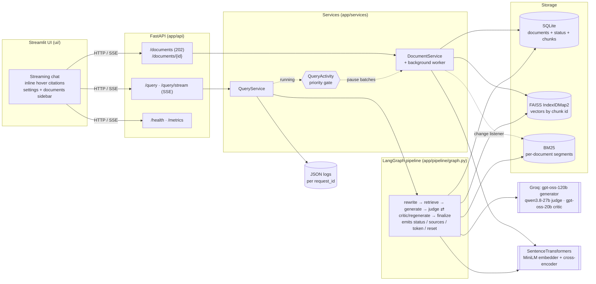
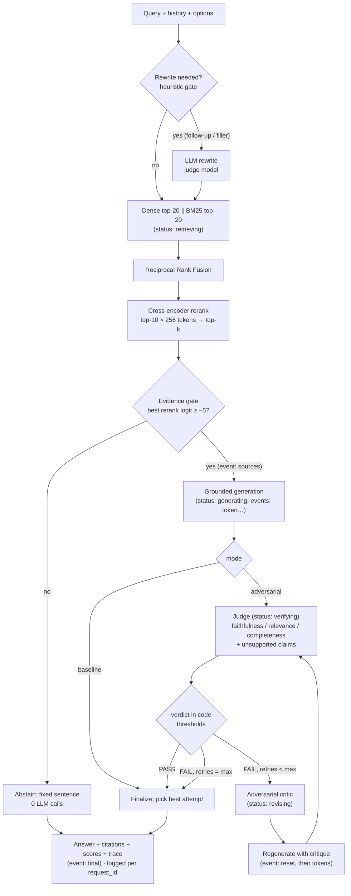

# Architecture and engineering decisions

This document explains *why* the system is built the way it is, what alternatives were considered, and what would change at larger scale. For setup and results see the [README](../README.md); for interview preparation see [INTERVIEW_GUIDE.md](INTERVIEW_GUIDE.md).

## 1. Component map

Layering rule: **routes → services → domain modules**. Route files only validate input and call a service; services own orchestration; domain modules (`ingestion/`, `retrieval/`, `generation/`) are plain functions/classes with no FastAPI or LangGraph imports. Everything is wired once in `app/services/container.py` (the composition root), which is also how tests inject a scripted LLM and a hashing embedder.

## 2. Request lifecycle (`POST /query` and `POST /query/stream`)

Both endpoints run the same graph. The streaming endpoint passes an `emit` callback through LangGraph's `configurable`, and nodes call it when present; `/query` simply doesn't pass one.

## 3. Key decisions

### 3.1 Why hybrid search instead of dense-only?

Dense embeddings capture paraphrase ("how many learners" ≈ "students sampled") but blur exact tokens: numbers (`0.959`), identifiers (`pre_known_answers`), acronyms (`ROC-AUC`), rare names. BM25 is the opposite. Their failures are largely uncorrelated, so combining them raises recall at almost no cost.

**Measured on our golden set** (see `eval/results/report.md`): dense-only missed questions whose key token was a number or code identifier (e.g. q05 "contamination rate" → `15%`); BM25 and hybrid retrieved them. On this particular corpus BM25 alone was the strongest single retriever — expected, because the questions were written by someone who had read the paper and reuse its vocabulary. Hybrid is the safer default when users paraphrase, which real users do.

**Fusion: Reciprocal Rank Fusion.** `score(d) = Σ 1/(k + rank_r(d))`, k = 60. Cosine similarity and BM25 scores live on incompatible scales (BM25 is unbounded and corpus-dependent), so a weighted *score* sum needs per-query normalization and tuned weights; RRF uses only ranks, has one robust parameter, and rewards agreement between retrievers. Alternatives: convex combination with min-max normalization (needs tuning data), learned fusion (needs labels at scale).

### 3.2a Document-level questions: index-time context (and better PDF text)

**The failure.** A user uploaded a research paper and asked "who are the authors?". The system refused: "not enough evidence". Tracing the stages showed storage was consistent (102 chunks = 102 vectors = 102 BM25 entries) and generation never ran; retrieval was the problem. The title page contains names, affiliations and e-mail addresses, but not the word "author". BM25 had zero matching terms, the bi-encoder similarity was 0.15, and the cross-encoder scored the title page −11.3, so the evidence gate (−5) correctly refused given what retrieval found. The same held for "what is the title?" and "which university?".

**Why it happens.** Chunk retrieval matches the question against the chunk's *own words*. Questions about the document itself (authors, title, affiliation, date, "what is this about") ask for a *role* the text plays, which the text never states.

**The fix: describe what the chunk is.** The first two chunks of a document's first page get a deterministic context sentence (`app/ingestion/context.py`): "First page of the document X. It gives the title…, the authors who wrote it, their affiliations (university, company or organization)…, and the abstract or summary…". It is stored in its own column and:

- prepended for **indexing** only (embedding, BM25, reranking), via `index_text`;
- shown to the **LLM** as "(Note about this passage: …)", so it can read a list of names as the authors;
- never part of the **cited passage**, which stays verbatim.

Wording was chosen by measurement: a filename-only header did nothing (−11.2); a short "title page: title, authors, affiliations" helped partly (−6.4); the descriptive sentence moved the title page to −3.5 / −0.7 / +0.2 for the authors / who-wrote / title questions, and left an unrelated question at −11.5.

**Result.** All five document-level test questions went from refused to correctly answered with a page-1 citation (end to end with the real models), off-topic questions are still refused with zero LLM calls, and the golden-set retrieval metrics are unchanged.

**Alternatives considered.** (1) An LLM-written context per chunk ("contextual retrieval") or an LLM-extracted metadata record per document: more general, but costs LLM calls at ingestion (rate-limited on the free tier) and adds generated text to the evidence. (2) Loosening the evidence gate: would let the generator see junk for genuinely unanswerable questions. (3) Query expansion / HyDE: an LLM call per query, and it still cannot make "authors" match a list of names. The deterministic context is free, reproducible and testable; the LLM-based variants are the natural next step for richer document types.

**Upgrading existing indexes.** The store records an `index_version`. On startup an older store gets the context back-filled (it is deterministic) and all vectors re-embedded; new stores are stamped at creation, so nothing is rebuilt needlessly.

**PDF extraction.** The same investigation showed pypdf gluing words in this two-column PDF ("ROC-AUC0.959", "realEdNetclickstreams"), which corrupts BM25 tokens. `pdfminer.six` (MIT, pure Python) keeps the spaces at similar speed and is now the primary extractor; pypdf validates the file and is the fallback (pdfminer missing, failing, or disagreeing on the page count). pypdf's own "layout" mode was tested and was worse (it interleaves columns and splits numbers).

### 3.2 BM25: own implementation, inverted index, per-document segments

- **IDF.** We use Lucene's IDF `ln(1 + (N − n + 0.5)/(n + 0.5))`. The common `rank_bm25` Okapi IDF `ln((N − n + 0.5)/(n + 0.5))` is ≤ 0 whenever a term appears in half the chunks, which made BM25 return *nothing* on small corpora. A unit test caught this (`test_bm25_works_on_tiny_corpus`).
- **Inverted index.** The first version scored every chunk for every query in Python, which is fine at 30 chunks and far too slow at the ~10⁵ chunks a 100 MB upload can produce. Each term now has posting arrays (chunk position, term frequency), scored with vectorized numpy, so a query touches only the chunks that contain its terms: **1.1 ms at 100k chunks**.
- **Segments.** A full rebuild at 100k chunks took ~33 s, and it ran after *every* upload or delete. Borrowing Lucene's design, each document is one immutable segment; document frequency, chunk count and total length are global, so scores are identical to a single index (tested). Adding a document builds only its segment (30 ms for a small file next to a 100k-chunk one); deleting drops the segment and subtracts its statistics. Updates are copy-on-write snapshots, so queries never see a half-applied change.
- **Limit.** Past ~10⁶ chunks, or with several replicas, move to OpenSearch/Elasticsearch, Tantivy or Postgres full-text.

### 3.3 Why reranking — and what we actually measured

A bi-encoder embeds query and chunk independently (fast, coarse). A cross-encoder reads the pair jointly with full attention (precise, one forward pass per pair), so it is only affordable on a shortlist.

Honest result on this corpus: the reranker **did not change hit rates** versus RRF alone (it hurt hit@3 in the first configuration). `ms-marco-MiniLM` is trained on web search passages; our chunks are dense tables of numbers. We keep it enabled by default for a different reason: its logits give a well-separated **evidence signal**, which drives the pre-LLM abstention gate more reliably than cosine similarity. On our data on-topic questions score ≥ −3.2 and off-topic ones −9 to −11, versus a 0.29 vs 0.12 margin for cosine.

**Cost tuning (measured).** Reranking 20 candidates at 512 tokens took ~2 s on the test CPU. Chunks are ~800 characters ≈ 200 tokens, so a 256-token cap barely truncates, and halving the candidates halves the work. At 10 × 256: identical hit@3/hit@5 on the golden set, MRR@5 0.800 vs 0.774, ~0.6 s. The abstention gap was re-checked (still −3.1 vs ≤ −9). It is one toggle (`RERANKER_ENABLED`) or request option (`use_reranker`) to turn off, and the `Reranker` protocol lets a hosted reranker (Cohere/Voyage/Jina) replace it with one class.

### 3.4 Why a *conditional* adversarial loop instead of always invoking a critic?

The v1 pipeline always ran generate → critique → synthesize. Its own evaluation (`eval/legacy/summary_v1.json`, n = 19, same-model judge, hand-transcribed) showed the always-on rewrite made answers **worse** (faithfulness 4.63 → 3.95 on a 1–5 scale) at **5.1×** latency. A rewrite step applied to an already-correct answer has nothing to fix and can only drift.

v2 changes three things:

1. **Gate on a judge.** Most answers pass the judge on the first attempt and return after 2 LLM calls. The critic runs only on FAIL.
2. **Verdict computed in code.** The LLM returns *measurements*; `apply_thresholds()` decides. The judge cannot be talked into a PASS, thresholds are tunable per request (and from the UI sidebar), and the logic is unit-tested.
3. **Keep the best attempt, not the last.** `select_best_attempt()` ranks by (PASS, grounded, aggregate score, earliest). A retry can never return something worse than the original — the exact failure mode of v1.

Two calibration bugs found with real models and fixed:

- The judge frequently listed unsupported claims yet still scored faithfulness 0.95 → PASS. Fix: any listed unsupported claim fails the verdict (`FAIL_ON_UNSUPPORTED_CLAIMS`).
- When all attempts failed, the highest *aggregate* score belonged to a fluent hallucinated answer, beating an honest "the sources don't explain X" answer that scored lower on relevance. Fix: grounding is a hard ranking key; the judge prompt no longer penalizes honest statements of missing coverage.

**Measured effect (eval/results/).** With `gpt-oss-120b` and a strict grounding prompt, the judge passed almost every first answer. The loop fired on 0/17 answered golden questions and 1/6 compound "bait" questions, with no measurable quality difference versus baseline (fact recall 0.898 vs 0.898), at ~2× LLM calls and tokens and ~1.2× net latency. So the conditional design did what it should (no v1-style degradation, and cost is paid only on failure), but these test sets do not show a quality gain. See README §9 for the full tables and caveats.

**Model separation.** Generator (`gpt-oss-120b`), judge (`qwen3.8-27b`) and critic (`gpt-oss-20b`) are three different models: a model grading its own output shows self-preference bias. The evaluation harness uses yet another role — an *independent evaluator* that must differ from the pipeline judge — so the loop is not graded by the judge it was optimized against.

**Termination guarantees.** Every FAIL edge increments `retries`; `route_after_judge` stops at `max_retries` (default 2, capped at 5 by validation); LangGraph's `recursion_limit` is an independent backstop. Worst case: 1 + 3 × max_retries LLM calls (8 at defaults).

### 3.5 Streaming a verified answer

Verification needs the complete answer, so the *verified* answer cannot be streamed as it is generated. The design streams the **draft** and lets verification overwrite it:

- `generate_answer(..., on_token=...)` streams content deltas from the provider. Reasoning deltas from gpt-oss are not forwarded. The same function post-processes the full text afterwards (citation validation, abstention detection), so streamed and non-streamed answers are identical.
- Before generation, the `sources` event sends the numbered chunks, so the UI can render citation badges while tokens arrive. Model-native markers (`【4†L1】`) and half-received markers are normalized client-side while streaming.
- On FAIL, the regenerate node emits `reset` before streaming the revised answer, so the client drops the draft.
- `final` carries the pipeline's **selected** answer, which may be an earlier attempt (best-attempt selection). The client always replaces the streamed text with it.
- Transport: `StreamingResponse` over a queue fed by a worker thread that runs the ordinary synchronous pipeline, so `/query` and `/query/stream` share all logic, logging and metrics. `X-Accel-Buffering: no` asks proxies not to buffer. Validation errors are plain 422 JSON before the stream starts; pipeline errors become an `error` event.
- LLM retries apply only while *opening* the stream: retrying after tokens were delivered would duplicate text.

Trade-off: users can see a draft change. The alternative, buffering until verified, means no text at all until the judge finishes; we chose visible progress plus an explicit "Checking…" / "Refining…" status line.

Measured on the test machine, the first token arrives after ~1–2 s of gpt-oss reasoning, and the rest of the answer takes ~0.3 s. Before that, retrieval plus rerank takes ~0.6 s. We also found that ~2 s of every UI request was Windows resolving `localhost` via IPv6 first; the client now uses `127.0.0.1` (6 ms).

### 3.6 Ingestion: background worker, progress, query priority

Uploads of up to 100 MB can mean tens of thousands of chunks, and embedding is CPU-bound (~21 chunks/s on the test laptop). Synchronous indexing would block the request for minutes and time out, so:

- **Register, then process.** `POST /documents` validates type, size and duplicates (SHA-256, with a `UNIQUE` constraint so the race is safe), inserts the document with `status=processing`, and returns **202**. A single-thread executor then parses → cleans → chunks → embeds in batches of 256 → writes chunks + vectors → `status=ready`. One worker means indexing never competes with itself for CPU.
- **Progress.** An in-memory `stage`/`progress` per document (`queued → parsing → embedding → indexing`), exposed on `GET /documents/{id}` and as a progress bar in the UI.
- **Failures are visible.** A background failure keeps the document as `status=failed` with the error, and re-uploading the same bytes retries it. The synchronous path (`?wait=true`, seed corpus, eval, tests) removes the document entirely on failure.
- **Cancellation and restarts.** Deleting a processing document sets a flag checked between batches. On startup, documents still `processing` (their bytes are gone) are marked failed with "interrupted by a server restart".
- **Queries first.** `QueryActivity` (`app/services/priority.py`) counts in-flight queries; the worker waits for it to reach zero before each embedding batch (capped at 10 s so indexing cannot starve). Measured: time to first token was 2.1 s while a 1,710-chunk upload was indexing, vs 3.0 s idle.
- **Crash safety.** Vectors are computed before any chunk is written. Chunks and vectors are then written under one lock, and if the FAISS write fails the chunks are deleted again (compensating action). FAISS is saved atomically (`tmp` + `os.replace`).

Alternatives considered: a separate worker process or queue, which is the right move at scale (§5) but adds infrastructure for one user; and ONNX Runtime for faster embedding, which was measured and was *not* faster on this CPU (15–23 vs 21 chunks/s).

### 3.7 Why FAISS (local) instead of a hosted vector database?

| | FAISS in-process | Hosted (Pinecone, Weaviate Cloud, Qdrant Cloud) / pgvector |
|---|---|---|
| Latency | ~1 ms, no network hop | 5–50 ms network round trip |
| Ops | none; a file | managed service or a DB to run |
| Cost | free | usage-based / instance |
| Multi-replica | each replica needs its own copy | shared, consistent |
| Metadata filtering | done in SQLite | native |
| Scale | exact search fine to ~10⁵–10⁶ vectors | 10⁸+ with sharding |

At this scale exact `IndexFlatIP` is both fastest and simplest. The design keeps FAISS *derivable*: SQLite is the source of truth, FAISS stores only vectors keyed by chunk id (`IndexIDMap2`, supports deletion), and startup `sync_index()` rebuilds it (in batches) if it is missing, corrupted, out of sync or built with a different embedding model. That makes the index disposable, which matters on hosts with ephemeral disks.

### 3.8 Why SQLite for documents/chunks?

Transactional, zero-ops, in the standard library, queryable. It holds document status and errors (added by an idempotent `ALTER TABLE` migration for older databases), chunk text and page numbers. WAL mode lets the API read while the ingestion worker writes.

### 3.9 Query rewriting only when needed

Rewriting costs an LLM call and can drift away from the user's exact wording, which hurts BM25. A deterministic gate triggers it only for follow-ups with unresolved references (when history exists) or conversational filler. Both the original and the retrieval query are returned. Guardrails reject empty or runaway rewrites; LLM failure falls back to the original query.

### 3.10 What the user sees vs what operators see

The chat UI shows only the question, the streamed answer, inline citation badges (the full passage in a popover, plus a collapsed Sources list), and a short stage caption. Settings (mode, top-k, reranker, rewrite, retries, thresholds) are in the sidebar and sent with each question. Retrieval scores, judge verdicts, critiques, timings and tokens are **operator** data: they go to JSON logs keyed by `request_id` (`app/observability/query_log.py`), to the API response, and to `/metrics`. Keeping them out of the chat keeps the UI simple without losing any debuggability.

Rendering safety: model output is HTML-escaped before badges are inserted; Markdown syntax inside popovers is entity-encoded; LaTeX `\( \)` / `\[ \]` is converted to Streamlit math with `<`/`>` replaced by `\lt`/`\gt`, so no model-generated HTML ever reaches the page.

### 3.11 Failure handling

| Failure | Behavior |
|---|---|
| Empty index | `status: no_documents`, 0 LLM calls |
| Irrelevant question | evidence gate → fixed abstention sentence, 0 LLM calls |
| Generator abstains | detected by exact-sentence match; `status: insufficient_evidence` |
| Unsupported type / too large / duplicate | immediate 415 / 413 / 409 (with the existing `document_id`) |
| Document-level question (authors, title, affiliation) | front-matter context makes the title page retrievable; answered with a page-1 citation |
| Unparseable or text-less file | background: `status=failed` + error, retryable by re-upload; `?wait=true`: 422 |
| Upload interrupted by restart | marked `failed` on startup |
| Document deleted while indexing | worker cancels at the next batch; nothing left behind |
| Embedding model failure | retrieval degrades to BM25-only (trace shows `dense_error`) |
| Reranker failure | fusion order used (trace shows the error) |
| Judge failure / bad JSON | answer returned flagged **unverified**, no retries |
| Critic failure | critique derived from the judge's findings; loop continues |
| LLM rate limit / timeout | own retry loop honoring `Retry-After`, total wait capped; then 429 (`Retry-After`) / 504, or an `error` event when streaming |
| Mid-stream provider error | not retried (would duplicate text); surfaced as an `error` event |
| Invalid citation markers `[9]` | stripped from the answer and reported in the trace |

### 3.12 Observability

A `Trace` per request collects OpenTelemetry-shaped spans (name, start offset, duration, status, attributes), token usage, LLM retries and **throttle time** (time spent waiting on provider rate limits, measured by our own retry loop). It is returned in every response and summarized in JSON log lines keyed by `request_id` (also echoed in the `x-request-id` header). `/metrics` exposes counters and p50/p95 latency per stage.

We deliberately did **not** add the OpenTelemetry SDK: with no collector to export to, it adds dependencies, not capability. Exporting later is an adapter over `Trace` (map `Span` → OTel span, `record_llm` → GenAI semantic-convention attributes).

Span logs carry only short scalar attributes. The per-query summary lines include the query text and unsupported-claim excerpts only when `LOG_CONTENT=true`; answers and chunk text are never logged.

Cost is reported only if `PRICE_PROMPT_PER_1M` / `PRICE_COMPLETION_PER_1M` are configured: provider prices change, so hardcoding them would silently go stale.

## 4. Trade-offs at a glance

| Lever | Reliability | Latency | Cost |
|---|---|---|---|
| Judge on every answer | catches unsupported claims | +0.3–0.5 s after the text is shown | +1 call |
| Critic + regenerate (only on FAIL) | fixes flagged answers | +2–4 s per retry; user sees the draft replaced | +2 calls per retry |
| `max_retries` | diminishing returns after 1–2 | linear | linear |
| Stricter thresholds | fewer bad answers pass | more retries | more calls |
| Cross-encoder rerank (10 × 256) | abstention signal; ranking gain corpus-dependent | +~0.6 s CPU | none (local) |
| Evidence gate | prevents answering from junk | saves a call | saves a call |
| Streaming | none (same answer) | text visible ~1–2 s in instead of after verification | none |
| Background ingestion + query priority | none | chat unaffected by indexing | indexing takes longer while chatting |
| Bigger top-k | higher recall | longer prompts | more tokens |

## 5. Scaling from one user to thousands

What breaks first, in order:

1. **Per-process state.** FAISS, BM25, metrics, ingestion progress and the ingestion worker live in one process; a second replica would have its own copies. → Move vectors to a shared store (pgvector if already on Postgres; Qdrant/Weaviate/OpenSearch otherwise), BM25 to OpenSearch/Elasticsearch or Postgres full-text, metrics to Prometheus, SQLite to Postgres, progress to the database or Redis. The service layer already isolates these behind `DocumentStore`, `DenseIndex`, `BM25Index`.
2. **CPU-bound models.** Query embedding and reranking (~0.6 s) hold a request thread, and document embedding (~21 chunks/s) is the ingestion bottleneck. → A dedicated inference service (e.g. Text Embeddings Inference) with batching, GPUs, or hosted embeddings/rerankers.
3. **LLM rate limits and latency.** A query costs 2–8 calls. → Provider tier upgrades, request queues with backpressure, per-tenant concurrency limits, and caching (below). Streaming already hides most of the perceived latency of the first answer.
4. **Ingestion.** Already asynchronous in-process (background worker with progress, cancellation, restart recovery, query priority). The next step is out-of-process workers (below).

### How Redis/caching would help

- **Answer cache** keyed by `(normalized query, corpus version, settings hash)` → identical questions cost 0 LLM calls; invalidate by bumping the corpus version on any upload/delete.
- **Embedding cache** for query vectors (many users ask the same things).
- **Judge-result cache** keyed by `(answer hash, context hash)` for re-asked questions.
- **Rate-limit tokens / semaphores** shared across replicas for the LLM provider budget.
- **Ingestion progress and the query-priority signal** shared across API and worker processes.
- **Semantic cache** (vector similarity over past queries) is possible but risky for reliability: near-duplicate questions can need different answers, so it should be conservative and scoped per tenant.

### From in-process background ingestion to a queue

Today `POST /documents` returns 202 and one worker thread in the API process indexes the file, pausing between embedding batches while queries run. That keeps a single server responsive, but it ties indexing to the API's CPU and loses in-flight work on restart (marked failed). At scale:

1. The API stores the raw file in object storage (S3/GCS), inserts the `documents` row with `status=processing`, enqueues a job (SQS / RabbitMQ / Redis Streams / Celery) and returns 202, exactly as now.
2. Workers, on GPU for embedding, parse → chunk → embed in batches → upsert vectors → mark `ready` (or `failed` with the error), writing progress to the database.
3. The UI keeps polling `GET /documents/{id}`; the API contract does not change.

Benefits: in-flight uploads survive API restarts because the bytes are in object storage and jobs can be retried; retries are idempotent via the content hash; and ingestion throughput scales independently of query serving.

### Authentication and multi-tenancy

- **AuthN:** OIDC/OAuth2 (JWT bearer tokens) validated in a FastAPI dependency; API keys for service-to-service.
- **Tenant isolation:** every `documents`/`chunks` row gets a `tenant_id`; every query filters by it. With pgvector/Qdrant use a tenant filter or a collection/namespace per tenant; Postgres row-level security as defense in depth. Cache keys include `tenant_id`.
- **AuthZ:** per-document ACLs (owner, shared-with) enforced at retrieval time — filtering *after* retrieval leaks via scores and top-k truncation, so the filter must be inside the vector/BM25 query.
- **Quotas:** per-tenant limits on uploads (count and size), indexing time, tokens and retries, since the adversarial loop multiplies LLM spend.

## 6. Deployment and persistence

The API holds state on disk (`DATA_DIR`: SQLite + FAISS). On hosts with ephemeral filesystems, uploads disappear on restart. Mitigations built in: FAISS rebuilds from SQLite automatically; `SEED_DIR` re-ingests a demo corpus at startup (content-hash de-duplication makes this idempotent). For durable user uploads, mount a persistent volume or move storage to managed Postgres + object storage.

Two deployment details come from the newer features:

- **100 MB uploads** need matching limits in any reverse proxy or platform in front of the API.
- **Streaming** needs a proxy that doesn't buffer `text/event-stream`.

See [DEPLOYMENT.md](DEPLOYMENT.md).
