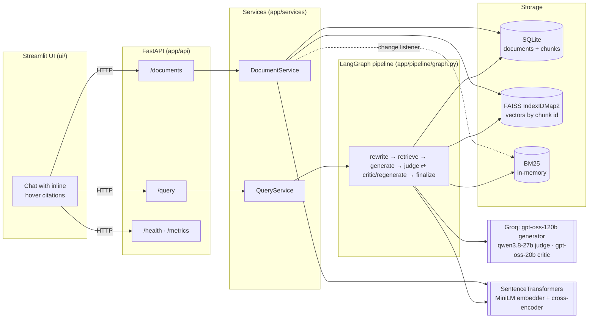
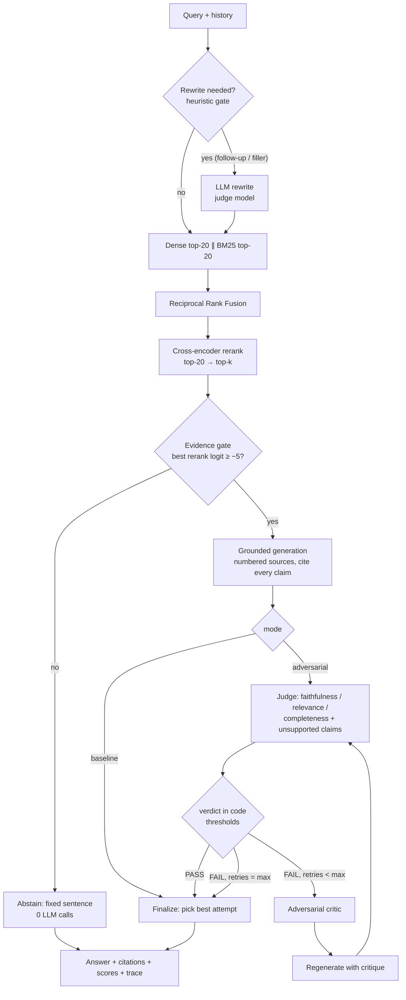

# Architecture and engineering decisions

This document explains *why* the system is built the way it is, what alternatives were considered, and what would change at larger scale. For setup and results see the [README](../README.md); for interview preparation see [INTERVIEW_GUIDE.md](INTERVIEW_GUIDE.md).

## 1. Component map

Layering rule: **routes → services → domain modules**. Route files only validate input and call a service; services own orchestration; domain modules (`ingestion/`, `retrieval/`, `generation/`) are plain functions/classes with no FastAPI or LangGraph imports. Everything is wired once in `app/services/container.py` (the composition root), which is also how tests inject a scripted LLM and a hashing embedder.

## 2. Request lifecycle (`POST /query`)

## 3. Key decisions

### 3.1 Why hybrid search instead of dense-only?

Dense embeddings capture paraphrase ("how many learners" ≈ "students sampled") but blur exact tokens: numbers (`0.959`), identifiers (`pre_known_answers`), acronyms (`ROC-AUC`), rare names. BM25 is the opposite. Their failures are largely uncorrelated, so combining them raises recall at almost no cost (BM25 over thousands of chunks is sub-millisecond).

**Measured on our golden set** (see `eval/results/report.md`): dense-only missed questions whose key token was a number or code identifier (e.g. q05 "contamination rate" → `15%`); BM25 and hybrid retrieved them. On this particular corpus BM25 alone was the strongest single retriever — expected, because the questions were written by someone who had read the paper and reuse its vocabulary. Hybrid is the safer default when users paraphrase, which real users do.

**Fusion: Reciprocal Rank Fusion.** `score(d) = Σ 1/(k + rank_r(d))`, k = 60. Cosine similarity and BM25 scores live on incompatible scales (BM25 is unbounded and corpus-dependent), so a weighted *score* sum needs per-query normalization and tuned weights; RRF uses only ranks, has one robust parameter, and rewards agreement between retrievers. Alternatives: convex combination with min-max normalization (needs tuning data), learned fusion (needs labels at scale).

**BM25 implementation detail.** We implement BM25 ourselves with Lucene's IDF `ln(1 + (N − n + 0.5)/(n + 0.5))`. The common `rank_bm25` Okapi IDF `ln((N − n + 0.5)/(n + 0.5))` is ≤ 0 whenever a term appears in half the chunks, which made BM25 return *nothing* on small corpora — caught by a unit test (`test_bm25_works_on_tiny_corpus`).

### 3.2 Why reranking — and what we actually measured

A bi-encoder embeds query and chunk independently (fast, coarse). A cross-encoder reads the pair jointly with full attention (precise, one forward pass per pair), so it is only affordable on a shortlist: we rerank the top-20 fused candidates.

Honest result on this corpus: the reranker **did not improve** hit@5 over RRF alone and **hurt** at k=3, while adding ~1 s of CPU latency per query. `ms-marco-MiniLM` is trained on web search passages; our chunks are dense tables of numbers. We keep it enabled by default for a different reason: its logits give a well-separated **evidence signal** (on-topic questions ≥ −3.2, off-topic ≈ −11 on our data), which drives the pre-LLM abstention gate more reliably than cosine similarity (0.29 vs 0.12 margin). It is one toggle (`RERANKER_ENABLED`) or one request option (`use_reranker`) to turn off, and the `Reranker` protocol lets a hosted reranker (Cohere/Voyage/Jina) replace it with one class.

### 3.3 Why a *conditional* adversarial loop instead of always invoking a critic?

The v1 pipeline always ran generate → critique → synthesize. Its own evaluation (`eval/legacy/summary_v1.json`, n = 19, same-model judge, hand-transcribed) showed the always-on rewrite made answers **worse** (faithfulness 4.63 → 3.95 on a 1–5 scale) at **5.1×** latency. A rewrite step applied to an already-correct answer has nothing to fix and can only drift.

v2 changes three things:

1. **Gate on a judge.** Most answers pass the judge on the first attempt and return after 2 LLM calls. The critic runs only on FAIL.
2. **Verdict computed in code.** The LLM returns *measurements*; `apply_thresholds()` decides. The judge cannot be talked into a PASS, thresholds are tunable per request, and the logic is unit-tested.
3. **Keep the best attempt, not the last.** `select_best_attempt()` ranks by (PASS, grounded, aggregate score, earliest). A retry can never return something worse than the original — the exact failure mode of v1.

Two calibration bugs found with real models and fixed:

- The judge frequently listed unsupported claims yet still scored faithfulness 0.95 → PASS. Fix: any listed unsupported claim fails the verdict (`FAIL_ON_UNSUPPORTED_CLAIMS`).
- When all attempts failed, the highest *aggregate* score belonged to a fluent hallucinated answer, beating an honest "the sources don't explain X" answer that scored lower on relevance. Fix: grounding is a hard ranking key; the judge prompt no longer penalizes honest statements of missing coverage.

**Measured effect (eval/results/).** With `gpt-oss-120b` and a strict grounding prompt, the judge passed almost every first answer. The loop fired on 0/17 answered golden questions and 1/6 compound "bait" questions, with no measurable quality difference versus baseline (fact recall 0.898 vs 0.898), at ~2× LLM calls and tokens and ~1.2× net latency. So the conditional design did what it should (no v1-style degradation, and cost is paid only on failure), but these test sets do not show a quality gain. See README §9 for the full tables and caveats.

**Model separation.** Generator (`gpt-oss-120b`), judge (`qwen3.8-27b`) and critic (`gpt-oss-20b`) are three different models: a model grading its own output shows self-preference bias. The evaluation harness uses yet another role — an *independent evaluator* that must differ from the pipeline judge — so the loop is not graded by the judge it was optimized against.

**Termination guarantees.** Every FAIL edge increments `retries`; `route_after_judge` stops at `max_retries` (default 2, capped at 5 by validation); LangGraph's `recursion_limit` is an independent backstop. Worst case: 1 + 3 × max_retries LLM calls (8 at defaults).

### 3.4 Why FAISS (local) instead of a hosted vector database?

| | FAISS in-process | Hosted (Pinecone, Weaviate Cloud, Qdrant Cloud) / pgvector |
|---|---|---|
| Latency | ~1 ms, no network hop | 5–50 ms network round trip |
| Ops | none; a file | managed service or a DB to run |
| Cost | free | usage-based / instance |
| Multi-replica | each replica needs its own copy | shared, consistent |
| Metadata filtering | done in SQLite | native |
| Scale | exact search fine to ~10⁵–10⁶ vectors | 10⁸+ with sharding |

At demo scale (thousands of chunks) exact `IndexFlatIP` is both fastest and simplest. The design keeps FAISS *derivable*: SQLite is the source of truth, FAISS stores only vectors keyed by chunk id (`IndexIDMap2`, supports deletion), and startup `sync_index()` rebuilds it if it is missing, corrupted, out of sync or built with a different embedding model. That makes the index disposable, which matters on hosts with ephemeral disks.

### 3.5 Why SQLite for documents/chunks?

Transactional, zero-ops, in the standard library, queryable. Ingestion order is chosen for crash safety: parse → chunk → **embed first** → one SQLite transaction → FAISS add + atomic file replace (`tmp` + `os.replace`); if the FAISS write fails, the SQLite rows are deleted again (compensating action). Duplicate uploads are rejected by SHA-256 of the raw bytes (a `UNIQUE` constraint backs the check under concurrency).

### 3.6 Query rewriting only when needed

Rewriting costs an LLM call and can drift away from the user's exact wording, which hurts BM25. A deterministic gate triggers it only for follow-ups with unresolved references (when history exists) or conversational filler. Both the original and the retrieval query are returned. Guardrails reject empty or runaway rewrites; LLM failure falls back to the original query.

### 3.7 Failure handling

| Failure | Behavior |
|---|---|
| Empty index | `status: no_documents`, 0 LLM calls |
| Irrelevant question | evidence gate → fixed abstention sentence, 0 LLM calls |
| Generator abstains | detected by exact-sentence match; `status: insufficient_evidence` |
| Unsupported / malformed file | 415 / 422 with a stable error `code` |
| Duplicate file | 409 with the existing `document_id` |
| Embedding model failure | retrieval degrades to BM25-only (trace shows `dense_error`) |
| Reranker failure | fusion order used (trace shows the error) |
| Judge failure / bad JSON | answer returned flagged **unverified**, no retries |
| Critic failure | critique derived from the judge's findings; loop continues |
| LLM rate limit / timeout | SDK retries with backoff; then 429 (`Retry-After`) / 504 |
| Invalid citation markers `[9]` | stripped from the answer and reported in the trace |

### 3.8 Observability

A `Trace` per request collects OpenTelemetry-shaped spans (name, start offset, duration, status, attributes) and token usage; it is returned in every response and logged as JSON lines keyed by `request_id` (also echoed in the `x-request-id` header). `/metrics` exposes counters and p50/p95 latency per stage. We deliberately did **not** add the OpenTelemetry SDK: with no collector to export to it adds dependencies, not capability. Exporting later is an adapter over `Trace` (map `Span` → OTel span, `record_llm` → GenAI semantic-convention attributes). Span logs carry only short scalar attributes. The per-query summary lines (`app/observability/query_log.py`: retrieval scores, per-attempt verdicts, timings, tokens) include the query text and unsupported-claim excerpts only when `LOG_CONTENT=true`; answers and chunk text are never logged. The chat UI shows none of this: it is for operators, not end users.

Cost is reported only if `PRICE_PROMPT_PER_1M` / `PRICE_COMPLETION_PER_1M` are configured: provider prices change, so hardcoding them would silently go stale.

## 4. Trade-offs at a glance

| Lever | Reliability | Latency | Cost |
|---|---|---|---|
| Judge on every answer | catches unsupported claims | +0.3–0.5 s | +1 call |
| Critic + regenerate (only on FAIL) | fixes flagged answers | +2–4 s per retry | +2 calls per retry |
| `max_retries` | diminishing returns after 1–2 | linear | linear |
| Stricter thresholds | fewer bad answers pass | more retries | more calls |
| Cross-encoder rerank | abstention signal; ranking gain corpus-dependent | +~1 s CPU | none (local) |
| Evidence gate | prevents answering from junk | saves a call | saves a call |
| Bigger top-k | higher recall | longer prompts | more tokens |

## 5. Scaling from one user to thousands

What breaks first, in order:

1. **Per-process state.** FAISS, BM25 and metrics live in one process; a second replica would have its own copy. → Move vectors to a shared store (pgvector if already on Postgres; Qdrant/Weaviate/OpenSearch otherwise), BM25 to OpenSearch/Elasticsearch or Postgres full-text, metrics to Prometheus, SQLite to Postgres. The service layer already isolates these behind `DocumentStore`, `DenseIndex`, `BM25Index`.
2. **CPU-bound models in the request path.** Embedding and cross-encoder inference hold a worker for ~1 s. → Run them in a dedicated inference service (e.g. Text Embeddings Inference) with batching, or on GPU; or use hosted embeddings/rerankers.
3. **LLM rate limits and latency.** At our settings a query costs 2–8 calls. → Provider tier upgrades, request queues with backpressure, concurrency limits per tenant, streaming the first answer while verification runs, and caching (below).
4. **Synchronous ingestion.** Large PDFs block an HTTP request. → Async ingestion queue (below).

### How Redis/caching would help

- **Answer cache** keyed by `(normalized query, corpus version, settings hash)` → identical questions cost 0 LLM calls; invalidate by bumping the corpus version on any upload/delete.
- **Embedding cache** for query vectors (many users ask the same things).
- **Judge-result cache** keyed by `(answer hash, context hash)` for re-asked questions.
- **Rate-limit tokens / semaphores** shared across replicas for the LLM provider budget.
- **Semantic cache** (vector similarity over past queries) is possible but risky for reliability: near-duplicate questions can need different answers, so it should be conservative and scoped per tenant.

### Asynchronous ingestion with a queue

`POST /documents` would store the raw file in object storage (S3/GCS), insert a `documents` row with `status=pending`, enqueue a job (SQS / RabbitMQ / Redis Streams / Celery) and return `202 Accepted` with the id. Workers parse → chunk → embed in batches → upsert vectors → mark `ready` (or `failed` with the error). The UI polls `GET /documents/{id}`. Benefits: large files do not time out, embedding can be batched on GPU workers, retries are idempotent (content hash), and ingestion throughput scales independently from query serving.

### Authentication and multi-tenancy

- **AuthN:** OIDC/OAuth2 (JWT bearer tokens) validated in a FastAPI dependency; API keys for service-to-service.
- **Tenant isolation:** every `documents`/`chunks` row gets a `tenant_id`; every query filters by it. With pgvector/Qdrant use a tenant filter or a collection/namespace per tenant; Postgres row-level security as defense in depth. Cache keys include `tenant_id`.
- **AuthZ:** per-document ACLs (owner, shared-with) enforced at retrieval time — filtering *after* retrieval leaks via scores and top-k truncation, so the filter must be inside the vector/BM25 query.
- **Quotas:** per-tenant limits on uploads, tokens and retries, since the adversarial loop multiplies LLM spend.

## 6. Deployment and persistence

The API holds state on disk (`DATA_DIR`: SQLite + FAISS). On hosts with ephemeral filesystems, uploads disappear on restart. Mitigations built in: FAISS rebuilds from SQLite automatically; `SEED_DIR` re-ingests a demo corpus at startup (content-hash de-duplication makes this idempotent). For durable user uploads, mount a persistent volume or move storage to managed Postgres + object storage. See [DEPLOYMENT.md](DEPLOYMENT.md).
